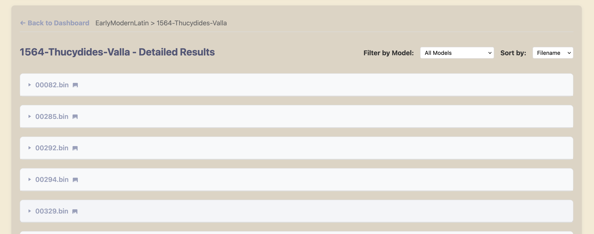

#  Palladia

**A Comprehensive Benchmarking Tool for Vision Language Models on Historical Document OCR**

[](https://dassoo.github.io/OCRacle)
[](https://python.org)
[](LICENSE.txt)
[](https://www.buymeacoffee.com/dassoo)

Palladia is a benchmarking tool for evaluating Vision Language Models on historical document OCR tasks using the GT4HistOCR dataset. It provides standardized evaluation metrics and an interactive dashboard for comparing model performance across different historical document types and languages.

## Table of Contents

- [What is Palladia?](#what-is-palladia)
- [Key Features](#key-features)
- [Supported Models](#supported-models)
- [Quick Start](#quick-start)
- [Dataset](#dataset)
- [Evaluation Metrics](#evaluation-metrics)
- [Results Dashboard](#results-dashboard)
- [Citation](#citation)
- [License](#license)

## What is Palladia?

Palladia addresses the challenge of evaluating Vision Language Models on historical document OCR tasks. Traditional OCR benchmarks focus on modern documents, but historical documents present unique challenges including:

- **Varied Typography**: Different fonts, handwriting styles, and printing techniques
- **Document Degradation**: Age-related artifacts, stains, and physical damage  
- **Language Evolution**: Historical spelling variations and obsolete words
- **Layout Complexity**: Non-standard formatting and mixed content types

This tool provides standardized evaluation across these challenging scenarios using the GT4HistOCR dataset. You can access the public dashboard at https://dassoo.github.io/Palladia.

## Key Features

- **Multi-Provider Support**: Evaluate models from many different providers
- **Standardized Metrics**: WER, CER, exact match accuracy, and execution time benchmarking
- **Interactive Dashboard**: Web-based results visualization with filtering and comparison tools
- **Batch Processing**: Efficient evaluation across large document collections
- **Export Capabilities**: Results available in JSON and visualization formats


## Supported Models

Most state-of-the-art Vision Language Models are actually supported through the GUI. The tool is designed to be easily extensible to eventually support additional models in the future.

*Model availability depends on API access and configuration*

## Quick Start

### Prerequisites
- Python 3.13+
- API keys for model providers you want to evaluate

### Installation

```bash
git clone https://github.com/dassoo/OCRacle.git
cd OCRacle
python -m venv .venv
source .venv/bin/activate  # Windows: .venv\Scripts\activate
pip install .
```

### Configuration

1. Copy the environment template:
```bash
cp .env.example .env
```

2. Add your API keys to `.env`:
```env
OPENAI_API_KEY=your_key_here
ANTHROPIC_API_KEY=your_key_here
GOOGLE_API_KEY=your_key_here
```

3. Download the evaluation dataset:
```bash
python scripts/download_dataset.py
```

### Run Your First Evaluation

```bash
python app.py
```

This launches the GUI where you can:
1. Select models to evaluate
2. Choose dataset subsets  
3. Configure evaluation parameters
4. Monitor progress in real-time

Results are automatically saved and viewable in the web dashboard that you can open from the GUI.

## Dataset

Palladia uses the **GT4HistOCR dataset**, a comprehensive collection of historical documents with ground truth transcriptions. The dataset includes:

- **Time Periods**: 15th-20th centuries
- **Languages**: Multiple European languages with historical variations
- **Quality Levels**: Various preservation states and image qualities

### Dataset Statistics
- **Total Images**: 300.000+ lines of historical documents
- **Ground Truth**: Human-verified transcriptions
- **Categories**: Organized by document type, period, and language
- **Format**: High-resolution images with corresponding text files

## Evaluation Metrics

Palladia provides comprehensive evaluation using industry-standard metrics:

| Metric | Description | Range | Best |
|--------|-------------|-------|------|
| **Word Error Rate (WER)** | Percentage of incorrectly transcribed words | 0-100% | 0% |
| **Character Error Rate (CER)** | Percentage of incorrectly transcribed characters | 0-100% | 0% |
| **Exact Match Accuracy** | Percentage of perfectly transcribed documents | 0-100% | 100% |
| **Execution Time** | Average processing time per document | Seconds | Lower |

### Statistical Analysis
- Confidence intervals for all metrics
- Statistical significance testing between models
- Error pattern analysis and categorization


## Results Dashboard

The interactive web dashboard provides comprehensive analysis tools:


### Performance Overview
- Aggregate statistics across all evaluated models
- Performance trends and comparative analysis
- Statistical significance indicators

### Individual Analysis



- Ground truth vs. model output comparison
- Character-level diff visualization with color coding
- Error pattern identification and categorization

### Advanced Features


- **Filtering**: Focus on specific models or metrics
- **Comparison**: Side-by-side model performance analysis


## Citation

If you use Palladia in your research, please cite:

```bibtex
@software{palladia2025,
  title={Palladia: A Benchmarking Tool for Vision Language Models on Historical Document OCR},
  author={Federico Dassiè},
  year={2025},
  url={https://github.com/dassoo/OCRacle}
}
```

## License

This project is licensed under the MIT License - see the [LICENSE.txt](LICENSE.txt) file for details.