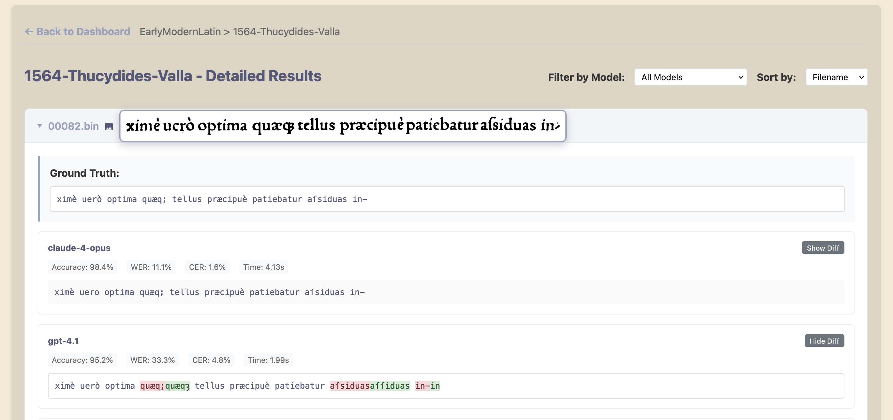

#  OCRacle

**A Comprehensive Benchmarking Framework for Vision Language Models on Historical Document OCR**

[](https://dassoo.github.io/OCRacle)
[](https://python.org)
[](LICENSE.txt)
[](https://www.buymeacoffee.com/dassoo)

OCRacle is a state-of-the-art benchmarking framework designed to evaluate Vision Language Models (VLMs) on historical document Optical Character Recognition (OCR) tasks. Built upon the comprehensive GT4HistOCR dataset, it provides researchers and practitioners with robust tools to assess model performance across diverse historical document types and languages. 

## Key Features

### Interactive Web Dashboard


- Real-time performance visualization
- Model comparison matrices
- Historical trend analysis
- Responsive design for all devices

### Detailed Analysis Tools


- Ground truth vs. model output comparison
- Character-level diff visualization
- Error pattern analysis
- Export capabilities for further research

## Installation

### Prerequisites
- Python 3.13 or higher
- API keys for desired model providers (OpenAI, Anthropic, Google, etc.)

### Quick Start

1. **Clone the repository:**
   ```bash
   git clone <repository-url>
   cd OCRacle
   ```

2. **Set up virtual environment:**
   ```bash
   python -m venv .venv
   source .venv/bin/activate  # On Windows: .venv\Scripts\activate
   ```

3. **Install dependencies:**
   ```bash
   pip install .
   ```

4. **Configure API credentials:**
   ```bash
   cp .env.example .env
   # Edit .env file with your API keys
   ```

5. **Download the GT4HistOCR dataset:**
   ```bash
   python utils/download_dataset.py
   ```

### Environment Configuration

Create a `.env` file with your API keys:
```env
OPENAI_API_KEY=your_openai_key_here
ANTHROPIC_API_KEY=your_anthropic_key_here
GOOGLE_API_KEY=your_google_key_here
# Add other provider keys as needed
```

## Usage

### Running Evaluations

1. **Launch the application:**
   ```bash
   source .venv/bin/activate  # On Windows: .venv\Scripts\activate
   python app.py
   ```

2. **Configure your evaluation:**
   - Select models to benchmark
   - Choose dataset subsets
   - Set evaluation parameters

3. **Monitor progress:**
   The GUI provides real-time feedback on evaluation progress

### Viewing Results

#### Interactive Dashboard


Open the dashboard to access:
- **Performance Overview**: Aggregate statistics across all models
- **Model Comparison**: Side-by-side performance metrics
- **Category Analysis**: Results broken down by document type
- **Individual Results**: Detailed analysis of each test image


## Results & Analytics

### Evaluation Metrics

| Metric | Description | Use Case |
|--------|-------------|----------|
| **Accuracy** | Percentage of perfectly transcribed documents | High-precision requirements |
| **WER** | Word Error Rate - Standard OCR accuracy measure | Overall transcription quality |
| **CER** | Character Error Rate - Fine-grained accuracy | Detailed error analysis |
| **Execution Time** | Processing time per document | Performance benchmarking |

### Dashboard Features


#### Advanced Analytics
- **Error Pattern Analysis**: Identify common transcription mistakes
- **Document Type Performance**: Compare accuracy across historical periods
- **Model Efficiency Metrics**: Balance accuracy vs. processing speed
- **Statistical Significance Testing**: Robust comparison methodologies

#### Interactive Elements
- **Sortable Tables**: Order results by any metric
- **Filtering Options**: Focus on specific models or document types
- **Diff Visualization**: Character-level comparison with ground truth
- **Export Functionality**: Download results in multiple formats

## Architecture

OCRacle is built with a modular architecture supporting:

- **Provider Abstraction**: Easy integration of new VLM providers
- **Configurable Evaluation**: YAML-based model and dataset configuration
- **Extensible Metrics**: Plugin system for custom evaluation metrics
- **Scalable Processing**: Batch asynchronous processing

## License

This project is licensed under the MIT License - see the [LICENSE.txt](LICENSE.txt) file for details.
